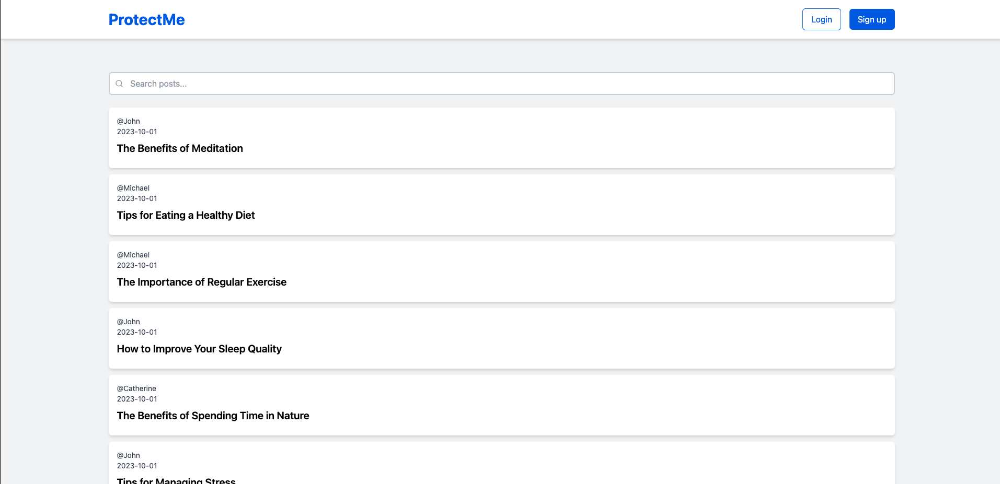

# ProtectMe



ProtectMe は、Web セキュリティについてハンズオンで学習するためのサービスです。このサービスでは、脆弱性を持つ Web サイト（ブログ）をローカル開発環境で起動し、攻撃と対策を体験することで、Web セキュリティについての理解を深めます。以下の脆弱性について学ぶことができます。

-   [XSS](./docs/ja/XSS.md)
-   [認可制御不備](./docs/ja/INSUFFICIENT_AUTHORIZATION_CHECK.md)

## 日本語 | [English](./docs/en/README.md)

## 環境構築

Docker を活用して、Laravel(Linux, nginx, MySQL,PHP)で開発されたマルチページアプリケーションをローカル開発環境で起動します。

### 前提

-   [Git](https://git-scm.com/)をインストール済み
-   [Docker for Mac / Windows](https://www.docker.com/products/docker-desktop/)をインストール済み

```console
$ git --version
git version x.x.x
$ docker --version
Docker version x.x.x, build xxxxx
```

### インストール

```console
# GitHubからソースコードをクローン
$ git clone git@github.com:yuta-sawamura/protect-me.git
Cloning into 'protect-me'...
remote: Enumerating objects: 606, done.
remote: Counting objects: 100% (136/136), done.
remote: Compressing objects: 100% (96/96), done.
remote: Total 606 (delta 49), reused 87 (delta 26), pack-reused 470
Receiving objects: 100% (606/606), 839.18 KiB | 1024.00 KiB/s, done.
Resolving deltas: 100% (273/273), done.

# protect-meディレクトリに移動
$ cd protect-me

# docker-compose.ymlを元にサービスをビルド
$ docker compose build
[+] Building 239.5s (24/24) FINISHED
 => [protect-me_db internal] load build definition from Dockerfile
.
.
.
 => [protect-me_app stage-0 5/5] COPY ./infra/docker/php/php.ini /usr/local/etc/php/php.ini

Use 'docker scan' to run Snyk tests against images to find vulnerabilities and learn how to fix them

# docker-compose.ymlを元にサービスをバックグラウンドで起動
$ docker compose up -d
[+] Running 4/4
 ⠿ Network "protect-me_default"  Created
 ⠿ Container protect-me_db_1     Started
 ⠿ Container protect-me_web_1    Started
 ⠿ Container protect-me_app_1    Started

# appサービスのコンテナ内でパッケージをインストール
$ docker compose exec app composer install
Installing dependencies from lock file (including require-dev)
Verifying lock file contents can be installed on current platform.
Package operations: 122 installs, 0 updates, 0 removals
  - Downloading composer/pcre (3.1.0)
.
.
.
Generating optimized autoload files
Class Tests\Feature\BlogControllerTest located in ./tests/Feature/Http/BlogControllerTest.php does not comply with psr-4 autoloading standard. Skipping.
Class Tests\Feature\UserControllerTest located in ./tests/Feature/Http/UserControllerTest.php does not comply with psr-4 autoloading standard. Skipping.
Class Tests\Unit\IndexTest located in ./tests/Unit/resources/views/blogs/IndexTest.php does not comply with psr-4 autoloading standard. Skipping.
> Illuminate\Foundation\ComposerScripts::postAutoloadDump
> @php artisan package:discover --ansi

   INFO  Discovering packages.

  laravel/breeze ........................................................ DONE
  laravel/sail .......................................................... DONE
  laravel/sanctum ....................................................... DONE
  laravel/tinker ........................................................ DONE
  nesbot/carbon ......................................................... DONE
  nunomaduro/collision .................................................. DONE
  nunomaduro/termwind ................................................... DONE
  spatie/laravel-ignition ............................................... DONE

93 packages you are using are looking for funding.
Use the `composer fund` command to find out more!

# appサービスのコンテナ内で.env.exampleを.env にコピー
$ docker compose exec app cp .env.example .env

# appサービスのコンテナ内でLaravelアプリケーションのセキュリティキーの生成
$ docker compose exec app php artisan key:generate
   INFO  Application key set successfully.

# appサービスのコンテナ内でpublicディレクトリからstorageディレクトリへのシンボリックリンクを作成
$ docker compose exec app php artisan storage:link
   INFO  The [public/storage] link has been connected to [storage/app/public].

# appサービスのコンテナ内でstorageディレクトリとbootstrap/cacheディレクトリに対して、再帰的に読み書き実行の権限を付与
$ docker compose exec app chmod -R 777 storage bootstrap/cache

# appサービスのコンテナ内でデータベースのマイグレーションとシーディングを実行
$ docker compose exec app php artisan migrate:fresh --seed
  Dropping all tables ........................................... 1,611ms DONE

   INFO  Preparing database.

  Creating migration table ........................................ 299ms DONE

   INFO  Running migrations.

  2014_10_12_000000_create_users_table ............................ 207ms DONE
  2014_10_12_100000_create_password_reset_tokens_table ............ 192ms DONE
  2019_08_19_000000_create_failed_jobs_table ...................... 200ms DONE
  2019_12_14_000001_create_personal_access_tokens_table ........... 180ms DONE
  2023_06_18_061828_create_blogs_table ............................ 631ms DONE

   INFO  Seeding database.

  Database\Seeders\UserSeeder ........................................ RUNNING
  Database\Seeders\UserSeeder ................................. 414.33 ms DONE

  Database\Seeders\BlogSeeder ........................................ RUNNING
  Database\Seeders\BlogSeeder .................................. 64.42 ms DONE
```

上記手順の完了後、ブラウザで http://localhost/ にアクセスしてください。

## ハンズオン

環境構築後、ハンズオンで脆弱性の理解を深めましょう。

-   [XSS](./docs/ja/XSS.md)
-   [認可制御不備](./docs/ja/INSUFFICIENT_AUTHORIZATION_CHECK.md)

## Tips

```console
# コンテナを作成する
$ docker compose up -d

# コンテナを破棄する
$ docker compose down

# コンテナ、イメージ、ボリュームを破棄する
$ docker compose down --rmi all --volumes

# テーブル、データをリセットする
$ docker compose exec app php artisan migrate:fresh --seed

# appコンテナに入る
$ docker compose exec app bash

# webコンテナに入る
$ docker compose exec web ash

# dbコンテナに入る
$ docker compose exec db bash

# dbコンテナのMySQLに接続する
$ docker compose exec db bash -c 'mysql -u $MYSQL_USER -p$MYSQL_PASSWORD $MYSQL_DATABASE'
```
