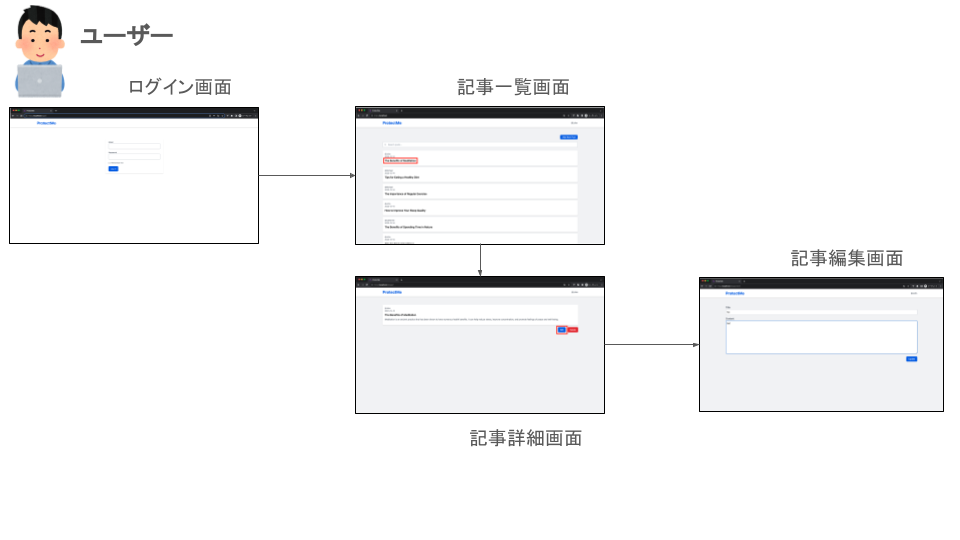
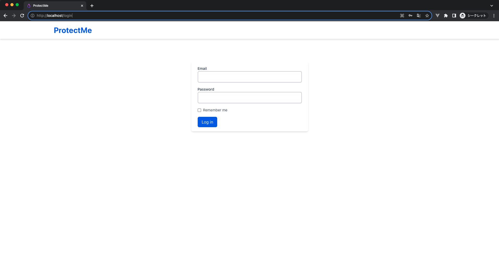
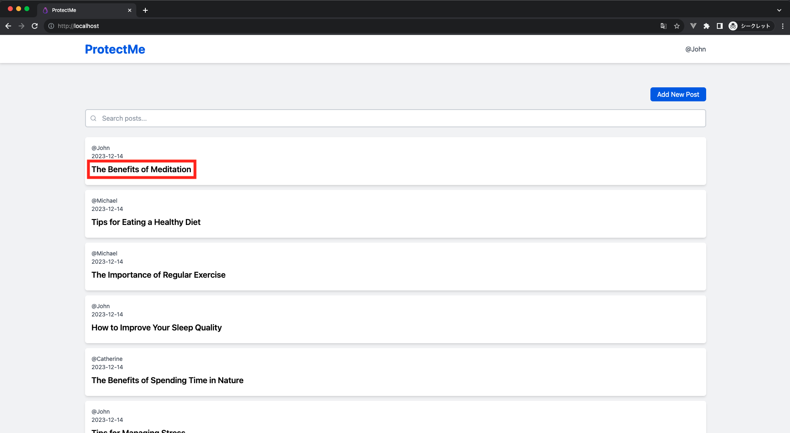
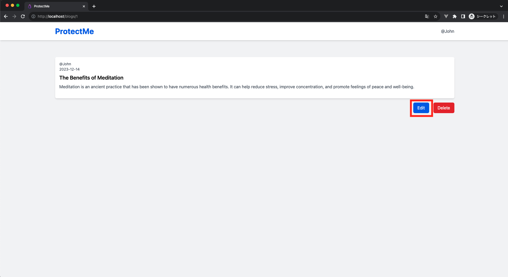
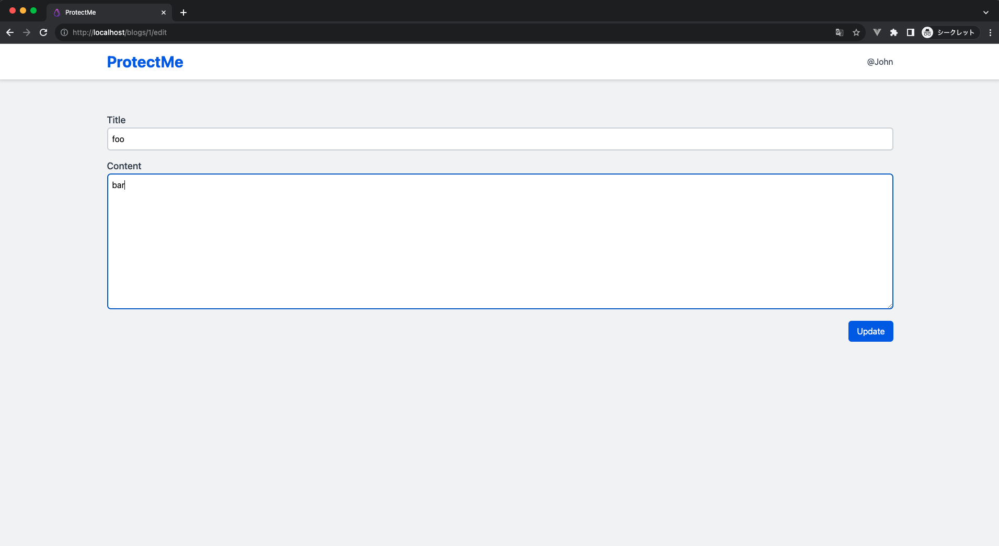

# Insufficient Authorization Check

Insufficient authorization check refers to a vulnerability where a logged-in user can access or modify data they are not permitted to. It's necessary to establish appropriate authorization mechanisms to verify users and prevent unauthorized access or modification of data.

## [日本語](../ja/INSUFFICIENT_AUTHORIZATION_CHECK.md) | English

## Possible Threats Arising from Insufficient Authorization Checks

When there is an insufficient authorization check, it becomes possible to impersonate a user. This can lead to the risk of leaking or tampering with the user's personal information.

## Attack Methods

In attacks exploiting insufficient authorization controls, attackers access resources or functionalities for which they do not have permission. This issue arises when a web application fails to properly authorize user actions.  
For example, an attacker might manipulate URL parameters or form data that are changeable, allowing them to view or modify another user's personal information.

## Mitigation Strategies

It is essential to validate the permissions of users for the actions they perform, ensuring that unauthorized operations are not allowed. Proper session management and secure handling of user IDs can prevent unauthorized access.  
For instance, manage user IDs using session information, and when accessing the database, use these IDs for verification. This approach ensures that only authorized users can perform specific actions, thereby safeguarding against unauthorized access or modifications.

## Hands-On (Attack)

### 1. Log In

Access http://localhost/login, enter Email: `john@example.com` and Password: `password`, and please log in.

### 2. Access My Page → User Information Edit Screen

As indicated in the attached image below, please access the My Page.



以下の添付画像に記載されているように、ユーザー情報編集画面にアクセスしてください。



### 3. Check the URL, Enter an Arbitrary ID, and Attempt to Impersonate Another User

On the User Information Edit Screen, check the URL. You can see that the ID is 1.



Change the part of the URL that is 1 to 2 and click 'Enter'.  
You were able to view another user's information. The Name of ProtectMe is public information, but the Email is private. Therefore, this is a data leak.



### 4. Edit Another User's Information

Enter arbitrary values in Name and Email, then click the 'Update' button.  
A flash message is displayed, and you were able to edit another user's information.



## Hands-On (Mitigation) - Implementing Authorization Control to Prevent Editing of Other User's Information

### Overview

The number 1 in http://localhost/users/1/edit is managed internally in the application as the `id` column in the `users` table.

| id  | name      | email                 |
| --- | --------- | --------------------- |
| 1   | John      | john@example.com      |
| 2   | Michael   | michael@example.com   |
| 3   | Catherine | catherine@example.com |

To prevent editing of other user's information, it is necessary to verify whether the logged-in user has the right to edit the target resource. For example, if the logged-in user is John, they can edit their resource (record with `users.id = 1`).

| Logged-in User           | Target Resource          |
| ------------------------ | ------------------------ |
| Managed in `users` table | Managed in `users` table |

Therefore, by implementing a process that allows editing if the logged-in user and the target resource match, and denies editing if they do not, authorization control can be achieved.

＜ Reference ＞  
Laravel has mechanisms like gates and policies for authorization control ([Details](https://readouble.com/laravel/10.x/en/authorization.html)). However, for learning purposes, we will implement authorization control ourselves without using Laravel's features.

### Explanation of the Relevant Code

```php
/**
 * Update the specified resource in storage.
 * @param Request $request // Receives an HTTP request instance.
 * @param int $id // Receives the ID of the resource (user) to be updated.
 * @return RedirectResponse // Returns a redirect response after updating.
 */
public function update(Request $request, int $id): RedirectResponse
{
     // Searches the database for a user with the specified ID and returns a 404 error if not found.
    $user = User::findOrFail($id);

    // Validates the request data.
    $validated = $request->validate([
        'name' => ['required', 'string', 'max:255'], // Name is required, string, up to 255 characters.
        'email' => [ // Validation rules for the email address.
            'required', // Mandatory item.
            'string', // Must be a string.
            'email', // Must be a valid email address format.
            'max:255', // Up to 255 characters maximum.
            Rule::unique('users')->ignore($user->id), // Unique in the users table, excluding the current user's ID.
        ],
    ]);

    // Updates user information with data that passed validation.
    $user->update($validated);

    // Redirects to the user edit page and stores a status message in the session.
    return redirect()->route('users.edit', $user)->with('status', 'Your profile has been updated.');
}
```

<https://github.com/yuta-sawamura/protect-me/blob/main/src/app/Http/Controllers/UserController.php#L46-L65>

### Implementing Authorization Control

Modify the existing code as follows to implement authorization control.

```php
/**
 * Update the specified resource in storage.
 * @param Request $request // Receives an HTTP request instance.
 * @param int $id // Receives the ID of the resource (user) to be updated.
 * @return RedirectResponse // Returns a redirect response after updating.
 */
public function update(Request $request, int $id): RedirectResponse
{
     // Searches the database for a user with the specified ID and returns a 404 error if not found.
    $user = User::findOrFail($id);

    // Authorization control
    // Comparing the logged-in user with the target resource for editing
    if (Auth::id() !== $user->id) {
        // Returns a 403 error
        abort(403, 'You do not have permission to edit this blog');
    }

    // Validates the request data.
    $validated = $request->validate([
        'name' => ['required', 'string', 'max:255'], // Name is required, string, up to 255 characters.
        'email' => [ // Validation rules for the email address.
            'required', // Mandatory item.
            'string', // Must be a string.
            'email', // Must be a valid email address format.
            'max:255', // Up to 255 characters maximum.
            Rule::unique('users')->ignore($user->id), // Unique in the users table, excluding the current user's ID.
        ],
    ]);

    // Updates user information with data that passed validation.
    $user->update($validated);

    // Redirects to the user edit page and stores a status message in the session.
    return redirect()->route('users.edit', $user)->with('status', 'Your profile has been updated.');
}

```

### Explanation of Authorization Control

> By implementing a process that allows editing if the logged-in user and the target resource match, and denies editing if they do not, authorization control can be achieved.

＜ Acquiring the Logged-in User ＞
The logged-in user is obtained using Laravel's `Auth` facade.  
`Auth::id()` is a part of Laravel's authentication system and can retrieve the ID of the currently logged-in user from the session. ([Details](https://readouble.com/laravel/10.x/en/authentication.html))

＜ Acquiring the Target Resource ＞

`User::findOrFail($id);` retrieves the target record from the `users` table in the database. Specifically, it issues the following SQL query to the database:

```sql
SELECT * FROM users WHERE id = [ID] LIMIT 1;
```

If `Auth::id() !== $user->id` does not match, editing is not permitted, so the `abort` function is used to generate an error response with an HTTP response code, immediately terminating the request processing.

```php
abort(403, 'You do not have permission to edit this blog');
```

### Confirming Authorization Control to Prevent Editing of Other User's Information

s another user's information at <http://localhost/users/2/edit>.  
Enter arbitrary values in Name and Email, and update. If an error screen like the one below is displayed, the authorization control is successful.


## Hands-On (Mitigation) - Implementing Authorization Control to Prevent Access to Other User's Information

Although it was possible to control the editing of other user's information, authorization control for accessing other user's information has not been implemented. Confirm that you can access another user's information at <http://localhost/users/2/edit>.  
The method of authorization control is the same as the one previously mentioned. Therefore, implement the same process in the `edit` action.

＜ Before Authorization Control ＞

```php
public function edit(int $id): View
{
    $user = User::findOrFail($id);
    return view('users.edit', [
        'user' => $user,
    ]);
}
```

<https://github.com/yuta-sawamura/protect-me/blob/main/src/app/Http/Controllers/UserController.php#L32-L44>

＜ After Authorization Control ＞

```php
public function edit(int $id): View
{
    $user = User::findOrFail($id);
    //  Authorization control
    if (Auth::id() !== $user->id) {
        abort(403, 'You do not have permission to edit this blog');
    }
    return view('users.edit', [
        'user' => $user,
    ]);
}
```

### Confirming Authorization Control to Prevent Access to Other User's Information

Access another user's information again at <http://localhost/users/2/edit>.  
If an error screen like the one below is displayed, the authorization control is successful.


Confirm that you can access your own user information without any issues at <http://localhost/users/1/edit>.  
If you can access normally like the image below, there is no problem.

