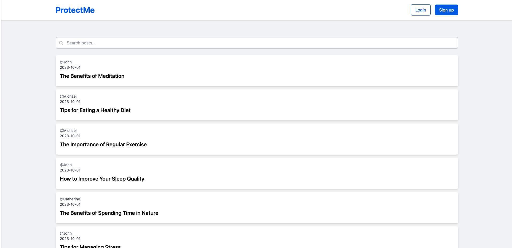

# ProtectMe



ProtectMe is a hands-on service designed to help users learn about web security. Through this service, users can launch vulnerable websites(Blog) on their local development environments, experience both cyber attacks and countermeasures firsthand, and thereby deepen their understanding of web security. Currently, you can learn about the following vulnerabilities:

-   [XSS](./XSS.md)
-   [Insufficient Authorization Check](./INSUFFICIENT_AUTHORIZATION_CHECK.md)

## [日本語](../../README.md) | English

## Setup

We utilize Docker to run a multi-page application developed in Laravel (Linux, nginx, MySQL, PHP) on your local development environment.

### Prerequisite

-   The preferred editor installed([Visual Studio Code](https://code.visualstudio.com/) recommended)
-   [Google Chrome](https://www.google.com/intl/ja_jp/chrome/) installed
-   [Docker for Mac / Windows](https://www.docker.com/products/docker-desktop/)installed

```console
$ docker --version
Docker version x.x.x, build xxxxx
```

### Downloading Source Code (Git Installed)

```console
# Clone source code from GitHub
$ git clone git@github.com:yuta-sawamura/protect-me.git
Cloning into 'protect-me'...
remote: Enumerating objects: 606, done.
remote: Counting objects: 100% (136/136), done.
remote: Compressing objects: 100% (96/96), done.
remote: Total 606 (delta 49), reused 87 (delta 26), pack-reused 470
Receiving objects: 100% (606/606), 839.18 KiB | 1024.00 KiB/s, done.
Resolving deltas: 100% (273/273), done.
```

### Downloading Source Code (Git Not Installed)

1. Visit the repository at https://github.com/yuta-sawamura/protect-me.
2. Click on the "Download ZIP" button to download the ZIP file to your local machine.
3. Unzip the downloaded ZIP file to access the contents.


### Installation

```console
# Go to protect-me directory
$ cd protect-me

# Build the service based on docker-compose.yml
$ docker compose build
[+] Building 239.5s (24/24) FINISHED
 => [protect-me_db internal] load build definition from Dockerfile
.
.
.
 => [protect-me_app stage-0 5/5] COPY ./infra/docker/php/php.ini /usr/local/etc/php/php.ini

Use 'docker scan' to run Snyk tests against images to find vulnerabilities and learn how to fix them

# Start the service in the background based on docker-compose.yml
$ docker compose up
[+] Running 4/4
 ⠿ Network "protect-me_default"  Created
 ⠿ Container protect-me_db_1     Started
 ⠿ Container protect-me_web_1    Started
 ⠿ Container protect-me_app_1    Started

# Install the package inside the app service container
$ docker compose exec app composer install
Installing dependencies from lock file (including require-dev)
Verifying lock file contents can be installed on current platform.
Package operations: 122 installs, 0 updates, 0 removals
  - Downloading composer/pcre (3.1.0)
.
.
.
Generating optimized autoload files
Class Tests\Feature\BlogControllerTest located in ./tests/Feature/Http/BlogControllerTest.php does not comply with psr-4 autoloading standard. Skipping.
Class Tests\Feature\UserControllerTest located in ./tests/Feature/Http/UserControllerTest.php does not comply with psr-4 autoloading standard. Skipping.
Class Tests\Unit\IndexTest located in ./tests/Unit/resources/views/blogs/IndexTest.php does not comply with psr-4 autoloading standard. Skipping.
> Illuminate\Foundation\ComposerScripts::postAutoloadDump
> @php artisan package:discover --ansi

   INFO  Discovering packages.

  laravel/breeze ........................................................ DONE
  laravel/sail .......................................................... DONE
  laravel/sanctum ....................................................... DONE
  laravel/tinker ........................................................ DONE
  nesbot/carbon ......................................................... DONE
  nunomaduro/collision .................................................. DONE
  nunomaduro/termwind ................................................... DONE
  spatie/laravel-ignition ............................................... DONE

93 packages you are using are looking for funding.
Use the `composer fund` command to find out more!

# Copy .env.example to .env in the app service container
$ docker compose exec app cp .env.example .env

# Generating security keys for Laravel applications within the container of the app service
$ docker compose exec app php artisan key:generate
   INFO  Application key set successfully.

# Create a symbolic link from the public directory to the storage directory in the app service container
$ docker compose exec app php artisan storage:link
   INFO  The [public/storage] link has been connected to [storage/app/public].

# Grant recursive read/write permissions to the storage directory and bootstrap/cache directory within the app service container
$ docker compose exec app chmod -R 777 storage bootstrap/cache

# Perform database migration and seeding within the app service container
$ docker compose exec app php artisan migrate:fresh --seed
  Dropping all tables ........................................... 1,611ms DONE

   INFO  Preparing database.

  Creating migration table ........................................ 299ms DONE

   INFO  Running migrations.

  2014_10_12_000000_create_users_table ............................ 207ms DONE
  2014_10_12_100000_create_password_reset_tokens_table ............ 192ms DONE
  2019_08_19_000000_create_failed_jobs_table ...................... 200ms DONE
  2019_12_14_000001_create_personal_access_tokens_table ........... 180ms DONE
  2023_06_18_061828_create_blogs_table ............................ 631ms DONE

   INFO  Seeding database.

  Database\Seeders\UserSeeder ........................................ RUNNING
  Database\Seeders\UserSeeder ................................. 414.33 ms DONE

  Database\Seeders\BlogSeeder ........................................ RUNNING
  Database\Seeders\BlogSeeder .................................. 64.42 ms DONE
```

After following the steps above, access the application by navigating to http://localhost/ in your browser.

## Hands-on

After building the setup, deepen your understanding of vulnerabilities through hands-on activities.

-   [XSS](./XSS.md)
-   [Insufficient Authorization Check](./INSUFFICIENT_AUTHORIZATION_CHECK.md)

## Tips

```console
# To create containers
$ docker compose up

# To destroy containers
$ docker compose down

# To remove containers, images, and volumes
$ docker compose down --rmi all --volumes

# To reset tables and data
$ docker compose exec app php artisan migrate:fresh --seed

# To enter the app container
$ docker compose exec app bash

# To enter the web container
$ docker compose exec web ash

# To enter the db container
$ docker compose exec db bash

# To connect to MySQL within the db container
$ docker compose exec db bash -c 'mysql -u $MYSQL_USER -p$MYSQL_PASSWORD $MYSQL_DATABASE'
```
