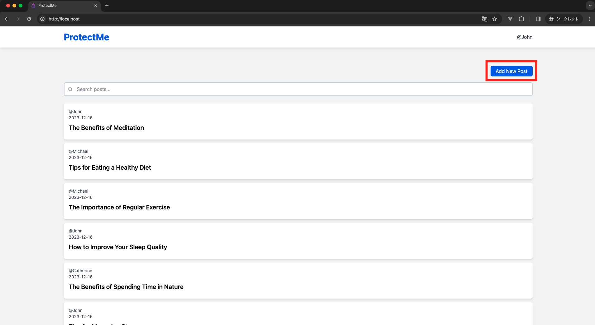
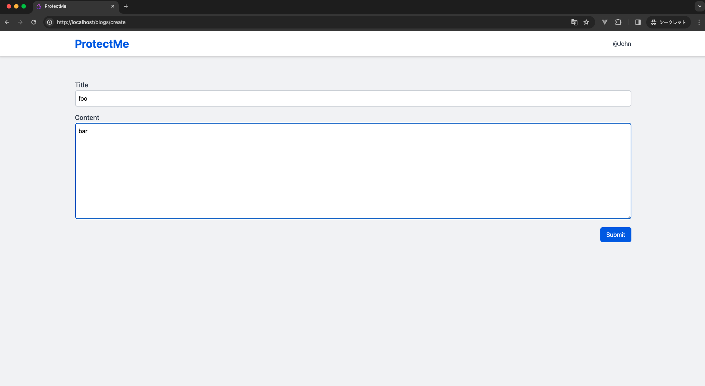

# XSS

Cross-Site Scripting (XSS) is a threat where attackers embed malicious scripts into a website, which are then executed in the browser of other users. If an XSS attack is successful, the attacker can steal user information or make the user perform fraudulent actions.

## [日本語](./docs/ja/xss.md) | English

## Potential Threats

When subjected to an XSS attack, the following threats can emerge:

-   Theft of Cookies
-   Unauthorized actions within the user's browser
-   Display of fake pages or ads

## Attack Methods

Attackers initiate the attack by entering malicious scripts into forms. The primary target of this attack isn't the website itself but the end-users utilizing the site.

Typical scenarios where XSS can be exploited:

-   Keyword search results page
-   System or application error notifications
-   User feedback or comment display areas (e.g., comments section of a blog)

## Countermeasures

The basic countermeasures to prevent XSS attacks are:

-   Input Validation: Verify if any scripts or tags are present when receiving user input
-   Output Escaping: When displaying data on a page, escape special characters so they are not executed as scripts

## Hands-on

Let's proceed to execute the attack and its countermeasure:

1. Log in

    Access http://localhost/login, enter Email: john@example.com, Password: password, and log in.

2. Enter a malicious script

    Navigate to http://localhost/blogs/create, enter Title:`<script>alert("XSS!!!");</script>`, Content:`Launching XSS attack.` and click the Submit button.<br>
    If you're redirected and an alert with JavaScript execution pops up, the attack was successful.


3. Verify the HTML

Check how the browser is parsing the entered script. Open the inspection tools in your browser and confirm the HTML. You should be able to see `<script>alert("XSS!!!");</script>` parsed.




4. Escape the Output

Below is the code snippet that retrieves and displays the blog title saved in the database:

```php
<?php echo $blog->title; ?>
```

https://github.com/yuta-sawamura/protect-me/blob/main/src/resources/views/blogs/index.blade.php#L44

In this code, user input is directly displayed in the browser, posing a risk for an XSS attack. Laravel's Blade template engine provides a default escape mechanism. Using this, special characters are escaped, ensuring scripts don't execute. The correction is as follows:

```php
{{ $blog->title; }}
```

5. Verify the Countermeasure

    Access http://localhost/ and ensure the malicious script isn't executed. Instead, you should see `<script>alert("XSS!!!");</script>` displayed as plain text.



When you check the HTML, where earlier `<script>alert("XSS!!!");</script>` was displayed, now you can confirm that it's been escaped to `&lt;script&gt;alert(&quot;XSS!!!&quot;);&lt;/script&gt;`.


