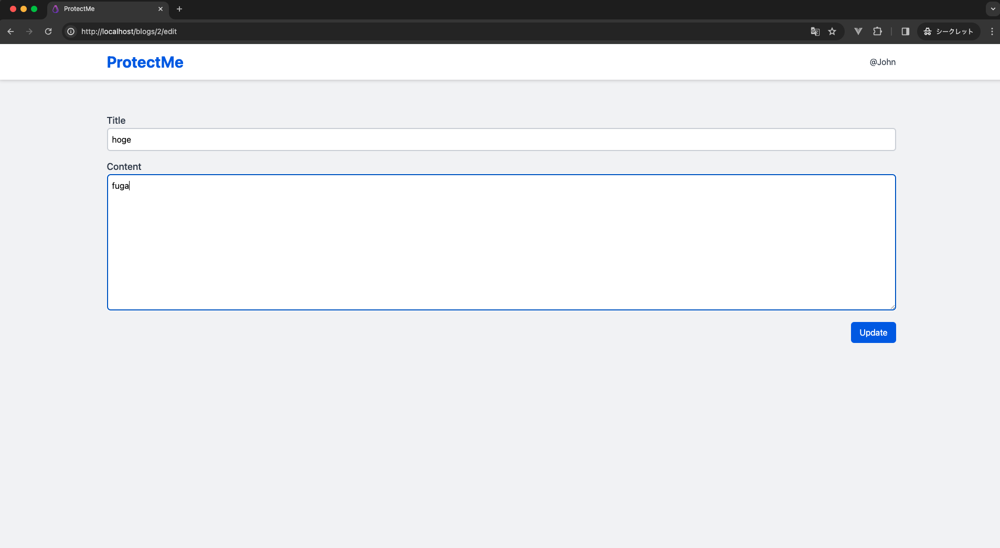
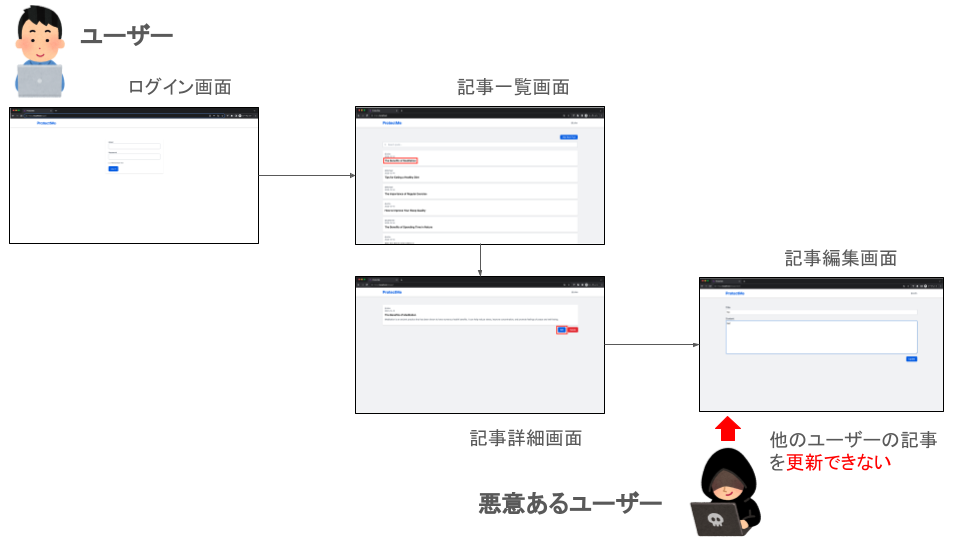

# 認可制御不備の概要

認可制御不備とは、ログイン済みのユーザーが許可されていないデータへのアクセスや機能を操作することができる脆弱性です。適切な認可の仕組みを設けることで、ユーザーを検証し、不正アクセスや操作を阻止する必要があります。

## 発生しうる脅威

認可制御不備があるとユーザーに成りすますことができます。これにより、ユーザーの個人情報の漏洩や改ざんされるリスクがあります。

## 攻撃手法

認可制御の不備による攻撃では、攻撃者はアクセスする権限のないデータへのアクセスや機能を操作します。これは、Web アプリケーションがユーザー操作を適切に認可していない場合に起こる問題です。例えば、攻撃者が URL のパラメータを変更し、他のユーザーの個人情報を閲覧します。

## 対策方法

ユーザーが実施する操作に対して、彼らの権限を検証し、許可されていない操作を行わせないようにする必要があります。セッション管理を適切に行い、ユーザー ID を安全に扱うことで、不正なアクセスを防ぐことができます。例えば、セッション情報を用いてユーザー ID を管理し、DB にアクセスする際はこの ID を用いて検証を行います。

＜セッション管理＞

セッション管理は、Web アプリケーションにおいて、ユーザーの訪問間で情報（例えばログイン状態）を保持する手法です。ユーザーがサイトにアクセスすると、サーバーは一意のセッション ID を生成し、ブラウザに送信します。この ID を通じて、ユーザーがログインしているか判断します。

## ハンズオン（正常な動作）

まずは通常利用し、正常な動作を確認します。自身が投稿した記事を更新します。


### 1. ログインする

すでにログイン済みの場合は不要です。  
<http://localhost/login> にアクセスし、Email：`john@example.com`, Password：`password`を入力し、ログインしてください。


### 2. 記事詳細画面、記事編集画面にアクセスする

記事一覧画面から`@John`が投稿した記事の詳細画面にアクセスします。


記事詳細画面から記事編集画面にアクセスします。


### 3. 記事を更新する

Title と Content に適当な文字列を入力し、「Update」ボタンをクリックします。


記事更新が成功します。


## ハンズオン（攻撃）

それでは、悪意あるユーザーとなって攻撃してみましょう！


### 1. ログインする

すでにログイン済みの場合は不要です。  
<http://localhost/login> にアクセスし、Email：`john@example.com`, Password：`password`を入力し、ログインしてください。


### 2. 記事詳細画面、記事編集画面にアクセスする

記事一覧画面から`@John`が投稿した記事の詳細画面にアクセスします。


記事詳細画面から記事編集画面にアクセスします。


自身のユーザー情報編集画面にアクセスできます。これは**正常な動作**です。

### 3. URL を確認し、適当な ID を入力し、他のユーザーのなりすましを試みる

記事編集画面にて、URL を確認します。ID が 1 であることを確認できます。


URL の 1 の部分を 2 に変更して、「Enter」をクリックします。<http://localhost/blogs/2/edit>  
ID 2 は`@Michael`の記事です。他のユーザーの記事編集画面にアクセスすることができました。他のユーザーの記事編集画面にアクセスできるのは望ましくありません。これは、**認可制御の不備**です。


### 4. 他のユーザーの記事を更新する

Title と Contetnt に適当な値を入力し、「Update」ボタンをクリックします。他のユーザーの記事を更新することができました。他のユーザーの記事が更新できるのは意図していない挙動です。つまり、**認可制御不備の攻撃が成功**しています。




## ハンズオン（対策） - 他のユーザーの記事を更新できないように認可制御する

他のユーザーの記事を更新できないように認可制御します。



### 認可制御の方法

記事編集画面で「Update」ボタンを押した際の処理の流れです。

1. HTTP 通信の POST リクエストを発行する
2. セッション情報からログインユーザーか判定する
3. URL の ID を元に `blogs` テーブルから更新対象の記事を取得する
4. `blogs` テーブルの対象記事を更新する


認可制御するには、3 と 4 の間にログインユーザーが対象記事を更新する権限があるかをチェックしなければなりません。DB は、以下のような構成になっています。

＜ users テーブル＞
| id | name | email |
| --- | --------- | --------------------- |
| 1 | John | john@example.com |
| 2 | Michael | michael@example.com |
| 3 | Catherine | catherine@example.com |

＜ blogs テーブル＞

| id  | user_id | title              | content              |
| --- | ------- | ------------------ | -------------------- |
| 1   | 1       | foo                | bar                  |
| 2   | 2       | hoge2              | fuga                 |
| 3   | 2       | The Importance ... | Regular exercise ... |
| 4   | 2       | How to Improve ... | Getting good ...     |
| 5   | 3       | The Benefits ...   | Spending time ...    |

例えば、`blogs.id = 2` の記事の title は hoge2 です。`blogs.user_id = 2` であるため、`@Michael` によって投稿されたことがわかります。


したがって、ログインユーザーの ID(`users.id`) と 記事の投稿者 ID(`blogs.user_id`)が一致しているかを確認することで、認可制御を実現できます。

＜参考＞  
Laravel では認可制御するために、ゲートやポリシーという仕組みが備わっています（[詳細](https://readouble.com/laravel/10.x/ja/authorization.html)）。今回は学習が目的であるため、Laravel の認可制御を使用せず、自前で実装します。

### 【改修前】 該当コードの解説

```php
/**
 * Update the specified resource in storage.
 * @param Request $request // HTTPリクエストインスタンスを受け取る
 * @param int $id // URLのIDを受け取る
 * @return RedirectResponse // 更新後にリダイレクトレスポンスを返す
 */
public function update(Request $request, int $id): RedirectResponse
{
    // リクエストデータのバリデーションを行う
    $request->validate([
        'title' => 'required|max:255',  // 必須項目、かつ最大255文字まで
        'content' => 'required', // 必須項目
    ]);

    // ID を元にblogsテーブルから更新対象の記事を取得する。存在しない場合は404エラーを返す
    $blog = Blog::findOrFail($id);

    // リクエストから受け取ったtitleとcontentをセットする
    $blog->title = $request->title;
    $blog->content = $request->content;

    // blogsテーブルの対象記事を更新する
    $blog->save();

    // 記事詳細画面にリダイレクトし、成功メッセージをセッションにセットする
    return redirect()->route('blogs.show', $blog)->with('status', 'Blog updated successfully');
}
```

[該当のソースコード](https://github.com/yuta-sawamura/protect-me/blob/main/src/app/Http/Controllers/BlogController.php#L91-L115)

### 認可制御の実装

既存コードを以下のように改修し、認可制御します。

```php
public function update(Request $request, int $id): RedirectResponse
{
    $request->validate([
        'title' => 'required|max:255',
        'content' => 'required',
    ]);

    $blog = Blog::findOrFail($id);

    // ログインユーザーのIDと記事の投稿者IDを比較し、認可制御する
    if (Auth::id() !== $blog->user_id) {
        // 403エラーを返す
        abort(403, 'You do not have permission');
    }

    $blog->title = $request->title;
    $blog->content = $request->content;
    $blog->save();

    return redirect()->route('blogs.show', $blog)->with('status', 'Blog updated successfully');
}
```

### 認可制御の解説

> ログインユーザーの ID(`users.id`) と 記事の投稿者 ID(`blogs.user_id`)が一致しているかを確認することで、認可制御を実現できます。

＜ログインユーザー ID の取得＞

ログインユーザーの取得は、Laravel の`Auth` ファサードを利用します。  
`Auth::id()` は Laravel の認証システムの一部であり、現在ログインしているユーザーの ID をセッションから取得することができます。（[詳細](https://readouble.com/laravel/10.x/ja/authentication.html)）

＜記事の投稿者 ID の取得＞

`Blog::findOrFail($id);` は、DB の `blogs` テーブルの対象記事を取得します。具体的には以下の SQL を発行し、DB に問い合わせます。

```sql
SELECT * FROM users WHERE id = [指定されたID] LIMIT 1;
```

`Auth::id() !== $blog->user_id` で比較し、一致しなければ更新不可であるため、`abort` 関数で HTTP レスポンスコードを指定してエラーレスポンスを生成し、即座にリクエスト処理を終了させます。

```php
abort(403, 'You do not have permission');
```

### 他のユーザーの記事を更新できないように認可制御できているか確認する

他のユーザーの記事編集画面にアクセスします。<http://localhost/blogs/2/edit>  
Title と Content に適当な値を入力し、「Update」ボタンをクリックします。以下のようなエラー画面が表示された場合、**認可制御が成功**しています。


## ハンズオン（対策） - 他のユーザーの記事編集画面にアクセスできないように認可制御する

他のユーザーの記事編集画面のアクセスに対する認可制御ができていません。他のユーザー情報にアクセスし、認可制御できていないことを確認します。<http://localhost/blogs/2/edit>  
こちらの認可制御方法も、前述した実装方法と同じです。そのため、`edit`アクションで先ほどと同じ処理を実装します。

＜認可制御前＞

```php
public function edit(int $id): View
{
    $blog = Blog::findOrFail($id);
    return view('blogs.edit', ['blog' => $blog]);
}
```

[該当ソースコード](https://github.com/yuta-sawamura/protect-me/blob/main/src/app/Http/Controllers/BlogController.php#L76-L89)

＜認可制御後＞

```php
public function edit(int $id): View
{
    $blog = Blog::findOrFail($id);

    if (Auth::id() !== $blog->user_id) {
        abort(403, 'You do not have permission');
    }

    return view('blogs.edit', ['blog' => $blog]);
}
```

### 他のユーザーの記事編集画面にアクセスできないように認可制御できているか確認する

他のユーザーの記事更新画面に改めてアクセスします。<http://localhost/users/2/edit>  
以下のようなエラー画面が表示された場合、**認可制御が成功**しています。


自身の記事編集画面には通常通りアクセスし、更新ができれば問題ありません。<http://localhost/blogs/1/edit>

## その他

次の演習のため、以下のコマンドでデータをリフレッシュしましょう。

```bash
$ docker compose exec app php artisan migrate:fresh --seed
```
