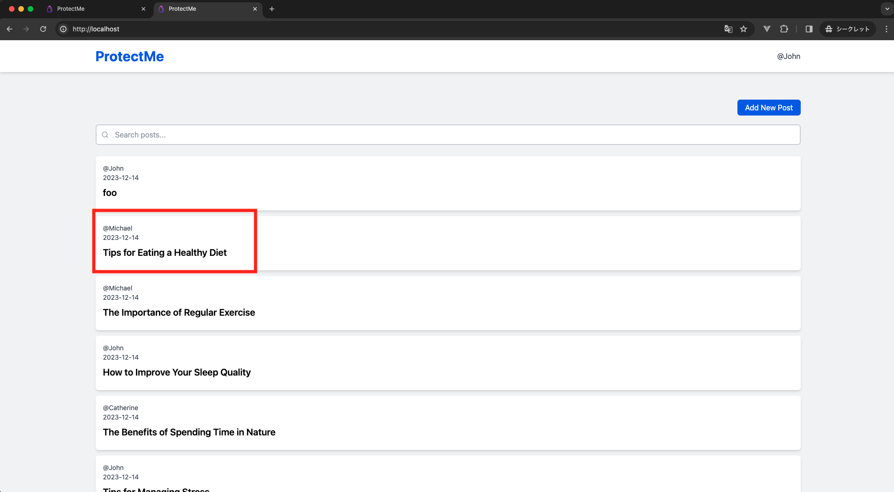

# 認可制御不備の概要

認可制御不備とは、ログイン済みのユーザーが許可されていないデータへのアクセスや機能を操作することができる脆弱性です。適切な認可の仕組みを設けることで、ユーザーを検証し、不正アクセスや操作を阻止する必要があります。

## 日本語 | [English](../en/INSUFFICIENT_AUTHORIZATION_CHECK.md)

## 発生しうる脅威

認可制御不備があるとユーザーに成りすますことができます。これにより、ユーザーの個人情報の漏洩や改ざんされるリスクがあります。

## 攻撃手法

認可制御の不備による攻撃では、攻撃者はアクセスする権限のないデータへのアクセスや機能を操作します。これは、Web アプリケーションがユーザー操作を適切に認可していない場合に起こる問題です。例えば、攻撃者が URL のパラメータを変更し、他のユーザーの個人情報を閲覧します。

## 対策方法

ユーザーが実施する操作に対して、彼らの権限を検証し、許可されていない操作を行わせないようにする必要があります。セッション管理を適切に行い、ユーザー ID を安全に扱うことで、不正なアクセスを防ぐことができます。例えば、セッション情報を用いてユーザー ID を管理し、データベースにアクセスする際はこの ID を用いて検証を行います。

＜セッション管理＞

セッション管理は、Web アプリケーションにおいて、ユーザーの訪問間で情報（例えばログイン状態）を保持する手法です。ユーザーがサイトにアクセスすると、サーバーは一意のセッション ID を生成し、ブラウザに送信します。この ID を通じて、ユーザーがログインしているか判断します。

## ハンズオン（正常な挙動）

まずは通常利用し、正常な挙動を確認します。自身が投稿した記事を更新します。


### 1. ログインする

http://localhost/login にアクセスし、Email：`john@example.com`, Password：`password`を入力し、ログインしてください。


### 2. 記事詳細画面、記事編集画面にアクセスする

記事一覧画面から`@John`が投稿した記事の詳細画面にアクセスします。


記事詳細画面から記事編集画面にアクセスします。


### 3. 記事を更新する

Title と Content に適当な文字列を入力し、「Update」ボタンをクリックします。


記事更新が成功します。


## ハンズオン（攻撃）

それでは、悪意あるユーザーとなって攻撃してみましょう！

### イメージ図


### 1. ログインする

http://localhost/login にアクセスし、Email：`john@example.com`, Password：`password`を入力し、ログインしてください。

### 2. マイページ → ユーザー情報編集画面にアクセスする

以下の添付画像に記載されているように、マイページにアクセスしてください。


以下の添付画像に記載されているように、ユーザー情報編集画面にアクセスしてください。


自身のユーザー情報編集画面にアクセスできます。これは**正常な動作**です。

### 3. URL を確認し、適当な ID を入力し、他のユーザーのなりすましを試みる

ユーザー情報編集画面にて、URL を確認します。ID が 1 であることが確認できます。


URL の 1 の部分を 2 に変更して、「Enter」をクリックします。  
他のユーザー情報を閲覧することができました。ProtectMe の Name は公開情報ですが、Email は非公開情報です。よって、これは**情報漏洩**です。これは、**認可制御不備の攻撃が成功**しています。


### 4. 他のユーザー情報を編集する

Name と Email に適当な値を入力し、「Update」ボタンをクリックします。  
フラッシュメッセージが表示され、他のユーザー情報を編集することができました。他のユーザー情報が編集できるのは意図していない挙動です。つまり、**認可制御不備の攻撃が成功**しています。


## ハンズオン（対策） - 他のユーザー情報を編集できないように認可制御する

### イメージ図



### 概要

<http://localhost/users/1/edit>の 1 がアプリケーション内部では、`users` テーブルの `id` カラムとして管理されています。
| id | name | email |
| --- | --------- | --------------------- |
| 1 | John | john@example.com |
| 2 | Michael | michael@example.com |
| 3 | Catherine | catherine@example.com |

他のユーザー情報を編集できないように認可制御するためには、ログインユーザーが編集の対象リソースを編集する権限を有しているか検証する必要があります。例えば、ログインユーザーが John だった場合、自身のリソース(`users.id = 1` のレコード)は編集可能です。

| ログインユーザー       | 対象リソース           |
| ---------------------- | ---------------------- |
| `users` テーブルで管理 | `users` テーブルで管理 |

したがって、ログインユーザーと編集の対象リソースが一致していれば編集可能、一致していなければ編集不可という処理を実装することで、認可制御を実現することができます。

＜参考＞  
Laravel では認可制御するために、ゲートやポリシーという仕組みが備わっています（[詳細](https://readouble.com/laravel/10.x/ja/authorization.html)）。今回は学習が目的であるため、Laravel の認可制御を使用せず、自前で実装します。

### 【改修前】 該当コードの解説

```php
/**
 * Update the specified resource in storage.
 * @param Request $request // HTTPリクエストインスタンスを受け取ります。
 * @param int $id // 更新するリソース（ユーザー）のIDを受け取ります。
 * @return RedirectResponse // 更新後にリダイレクトレスポンスを返します。
 */
public function update(Request $request, int $id): RedirectResponse
{
     // 指定されたIDを持つユーザーをデータベースから検索し、見つからない場合は404エラーを返します。
    $user = User::findOrFail($id);

    // リクエストデータのバリデーションを行います。
    $validated = $request->validate([
        'name' => ['required', 'string', 'max:255'], // 名前は必須、文字列、最大255文字まで。
        'email' => [ // メールアドレスに関するバリデーションルール。
            'required', // 必須項目。
            'string', // 文字列であること。
            'email', // 有効なメールアドレス形式であること。
            'max:255', // 最大255文字まで。
            Rule::unique('users')->ignore($user->id), // ユーザーテーブル内で一意であり、現在のユーザーのIDは除外する。
        ],
    ]);

    // ユーザー情報を更新します。
    $user->update($validated);

    // ユーザー編集ページにリダイレクトし、ステータスメッセージをセッションに格納します。
    return redirect()->route('users.edit', $user)->with('status', 'Your profile has been updated.');
}
```

<https://github.com/yuta-sawamura/protect-me/blob/main/src/app/Http/Controllers/UserController.php#L46-L65>

### 認可制御の実装

既存コードを以下のように改修し、認可制御をします。

```php
/**
 * Update the specified resource in storage.
 * @param Request $request // HTTPリクエストインスタンスを受け取ります。
 * @param int $id // 更新するリソース（ユーザー）のIDを受け取ります。
 * @return RedirectResponse // 更新後にリダイレクトレスポンスを返します。
 */
public function update(Request $request, int $id): RedirectResponse
{
     // 指定されたIDを持つユーザーをデータベースから検索し、見つからない場合は404エラーを返します。
    $user = User::findOrFail($id);

    // 認可制御
    // ログインユーザーと編集の対象リソースの比較
    if (Auth::id() !== $user->id) {
        // 403エラーを返却する
        abort(403, 'You do not have permission');
    }

    // リクエストデータのバリデーションを行います。
    $validated = $request->validate([
        'name' => ['required', 'string', 'max:255'], // 名前は必須、文字列、最大255文字まで。
        'email' => [ // メールアドレスに関するバリデーションルール。
            'required', // 必須項目。
            'string', // 文字列であること。
            'email', // 有効なメールアドレス形式であること。
            'max:255', // 最大255文字まで。
            Rule::unique('users')->ignore($user->id), // ユーザーテーブル内で一意であり、現在のユーザーのIDは除外する。
        ],
    ]);

    // ユーザー情報を更新します。
    $user->update($validated);

    // ユーザー編集ページにリダイレクトし、ステータスメッセージをセッションに格納します。
    return redirect()->route('users.edit', $user)->with('status', 'Your profile has been updated.');
}
```

### 認可制御の解説

> ログインユーザーと編集の対象リソースが一致していれば編集可能、一致していなければ編集不可という処理を実装することで、認可制御を実現することができます。

＜ログインユーザーの取得＞

ログインユーザーの取得は、Laravel の`Auth` ファサードを利用します。  
`Auth::id()` は Laravel の認証システムの一部であり、現在ログインしているユーザーの ID をセッションから取得することができます。（[詳細](https://readouble.com/laravel/10.x/ja/authentication.html)）

＜対象リソースの取得＞

`User::findOrFail($id);` は、データベースの `users` テーブルの対象レコードを取得します。具体的には以下の SQL を発行し、データベースに問い合わせます。

```sql
SELECT * FROM users WHERE id = [指定されたID] LIMIT 1;
```

`Auth::id() !== $user->id`で比較し、合致しなければ編集不可であるため、`abort` 関数で HTTP レスポンスコードを指定してエラーレスポンスを生成し、即座にリクエスト処理を終了させます。

```php
abort(403, 'You do not have permission');
```

### 他のユーザー情報を編集できないように認可制御できているか確認する

他のユーザー情報にアクセスします。<http://localhost/users/2/edit>  
Name と Email に適当な値を入力し、更新します。以下のようなエラー画面が表示された場合、**認可制御が成功**しています。


## ハンズオン（対策） - 他のユーザー情報にアクセスできないように認可制御する

他のユーザー情報の編集機能は認可制御することができましたが、他のユーザー情報のアクセスに対する認可制御ができていません。他のユーザー情報にアクセスし、認可制御できていないことを確認します。<http://localhost/users/2/edit>  
こちらの認可制御方法も、前述した実装方法と同じです。そのため、`edit`アクションで先ほどと同じ処理を実装します。

＜認可制御前＞

```php
public function edit(int $id): View
{
    $user = User::findOrFail($id);
    return view('users.edit', [
        'user' => $user,
    ]);
}
```

https://github.com/yuta-sawamura/protect-me/blob/main/src/app/Http/Controllers/UserController.php#L32-L44

＜認可制御後＞

```php
public function edit(int $id): View
{
    $user = User::findOrFail($id);
    // 認可制御
    if (Auth::id() !== $user->id) {
        abort(403, 'You do not have permission');
    }
    return view('users.edit', [
        'user' => $user,
    ]);
}
```

### 他のユーザー情報にアクセスできないように認可制御できているか確認する

他のユーザー情報に改めてアクセスします。<http://localhost/users/2/edit>  
以下のようなエラー画面が表示された場合、**認可制御が成功**しています。


自身のユーザー情報には問題なくアクセスできるか確認します。<http://localhost/users/1/edit>  
以下のように正常アクセスできれば問題ありません。

