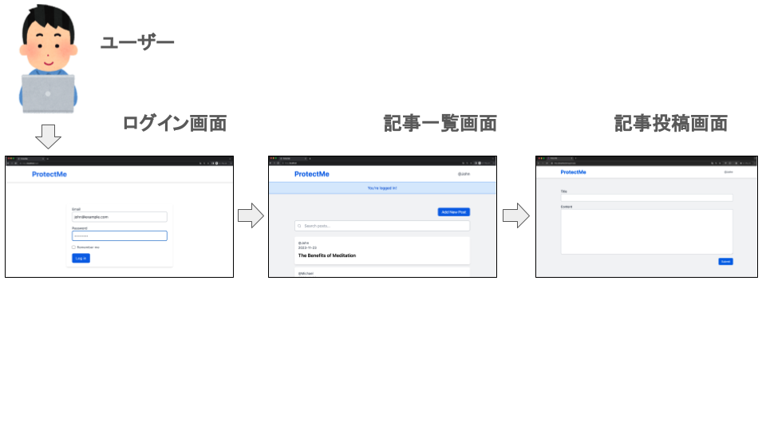

# XSS の概要

クロスサイトスクリプティング（XSS）は、攻撃者が Web サイトに悪意のあるスクリプトを埋め込むことで、他のユーザーのブラウザで実行させる脅威です。XSS が成功すると、攻撃者はユーザの情報を盗んだり、偽の操作をユーザにさせたりできます。

## 発生しうる脅威

XSS 攻撃を受けると、以下のような脅威が発生します。

-   Cookie を取得される
-   ユーザーのブラウザ内での不正な操作
-   偽のページや広告の表示

## 攻撃手法

攻撃者はフォームに悪意のあるスクリプトを入力することで攻撃を仕掛けます。この攻撃の主要なターゲットは、Web サイト自体ではなく、そのサイトを利用するエンドユーザーです。

XSS が利用される典型的なシーン:

-   キーワード検索結果ページ
-   システムやアプリケーションエラー通知
-   ユーザーからのフィードバックやコメント表示部分（例:ブログのコメント欄）

## 対策方法

XSS 攻撃を防ぐための基本的な対策は以下の通りです。

-   入力の検証：ユーザからの入力を受け取る際、スクリプトやタグが含まれていないかを検証する
-   出力のエスケープ：ページにデータを表示する際、スクリプトとして実行されないよう特殊文字をエスケープする

## ハンズオン（正常な動作）

まずは通常利用し、正常な動作を確認します。記事を投稿します。



### 1. ログインする

http://localhost/login にアクセスし、Email：`john@example.com`, Password：`password`を入力し、ログインしてください。


### 2. 記事投稿画面にアクセスする

記事一覧画面から、記事投稿画面にアクセスしてください。


### 3. 記事を投稿する

Title と Content に適当な文字列を入力後、「Submit」ボタンをクリックし、記事を投稿します。


## ハンズオン（攻撃）

それでは、悪意あるユーザーとなって攻撃してみましょう！


### 1. ログインする

すでにログイン済みの場合は不要です。  
http://localhost/login にアクセスし、Email：`john@example.com`, Password：`password`を入力し、ログインしてください。


### 2. 記事投稿画面にアクセスする

記事一覧画面から、記事投稿画面にアクセスしてください。


### 3. 記事投稿画面でをスクリプトを投稿する

<http://localhost/blogs/create> にアクセスし、Title：`<script>alert("XSS!!!");</script>`, Content：`XSSを仕掛けます。`と入力し、「Submit」ボタンをクリックしてください。`<script>alert("XSS!!!");</script>`は、Web サイト上に「XSS!!!」というテキストを含むアラートを表示するための JavaScript です。


投稿後、画面遷移し、アラートが表示されれば攻撃成功です。このアラートは全ユーザーに表示されます。


### 4. HTML を確認する

入力した JavaScript がブラウザでどのように解析されているか確認します。ブラウザでダブルクリックし、「ページのソースを表示」を選択し、HTML を確認してください。`<script>alert("XSS!!!");</script>`と解析されているのが確認できます。


スクリプトを使用して、ユーザーのブラウザ内で不正な操作や偽のページや広告の表示するなど悪用することが可能になります。よって、一般的な Web サイトは、ユーザーの入力したスクリプトを無効化します。

## ハンズオン（対策）

### 1. 出力のエスケープ

以下は、ユーザーの入力した記事のタイトルを表示する記述です。

```php
<?php echo $blog->title; ?>
```

[該当ソースコード](https://github.com/yuta-sawamura/protect-me/blob/main/src/resources/views/blogs/index.blade.php#L44)

このコードでは、ユーザーの入力がそのままブラウザに出力されます。これは、XSS 攻撃のリスクがあるため避ける必要があります。Laravel の Blade テンプレートエンジンは、デフォルトでエスケープ方法を提供しています。これを利用すると、スクリプトが実行されないように特殊文字がエスケープされます。以下のように該当コードを修正してください。

```php
<?php echo $blog->title; ?>
```

↓

```php
{{ $blog->title; }}
```

＜エスケープ処理＞  
エスケープ処理とは、プログラミングにおいて特定の文字が持つ特別な意味を取り消し、文字列として扱うための方法です。たとえば、HTML では「<」や「>」はタグを表すため、これらの文字をそのまま表示させたい場合はエスケープ処理を施す必要があります。同様に、プログラミング言語などで、特定の記号や文字列がコマンドや指示として解釈されるのを防ぐためにも用いられます。これにより、不正なコードの実行を防いだり、データの正確な入力・表示を保証したりすることができます。

### 2. 対策の確認

<http://localhost/> にアクセスしてください。JavaScript は実行されず、`<script>alert("XSS!!!");</script>`という文字列が表示されます。これは XSS 攻撃に対する正しい対策ができている証拠です。


ブラウザでダブルクリックし、「ページのソースを表示」を選択しき、HTML を確認してください。先ほどは`<script>alert("XSS!!!");</script>`と表示されていたのが、`&lt;script&gt;alert(&quot;XSS!!!&quot;);&lt;/script&gt;`とスクリプト部分がエスケープ処理が施されていることが確認できます。


## その他

次の演習のため、以下のコマンドでデータをリフレッシュしましょう。

```bash
$ docker compose exec app php artisan migrate:fresh --seed
```
