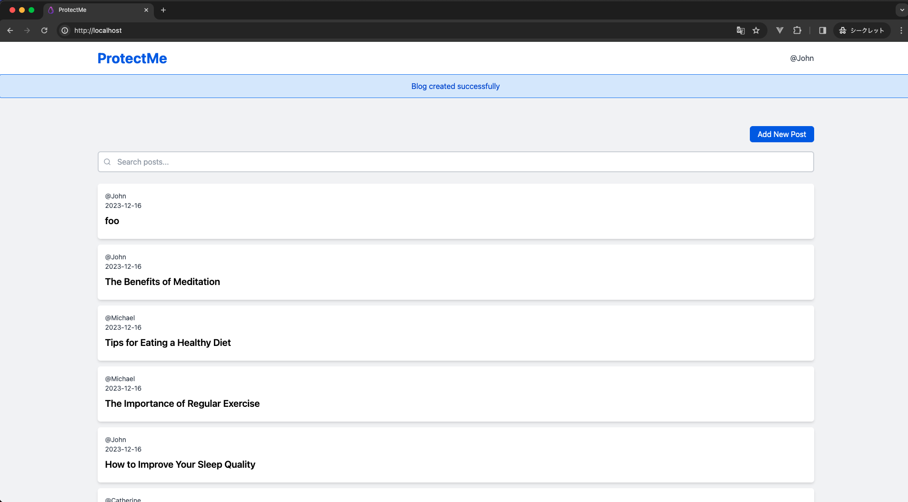

# XSS の概要

クロスサイトスクリプティング（XSS）は、攻撃者が Web サイトに悪意のあるスクリプトを埋め込むことで、他のユーザーのブラウザで実行させる脅威です。XSS が成功すると、攻撃者はユーザの情報を盗んだり、偽の操作をユーザにさせたりできます。

## 日本語 | [English](../en/XSS.md)

## 発生しうる脅威

XSS 攻撃を受けると、以下のような脅威が発生します。

-   Cookie を取得される
-   ユーザーのブラウザ内での不正な操作
-   偽のページや広告の表示

## 攻撃手法

攻撃者はフォームに悪意のあるスクリプトを入力することで攻撃を仕掛けます。この攻撃の主要なターゲットは、Web サイト自体ではなく、そのサイトを利用するエンドユーザーです。

XSS が利用される典型的なシーン:

-   キーワード検索結果ページ
-   システムやアプリケーションエラー通知
-   ユーザーからのフィードバックやコメント表示部分（例:ブログのコメント欄）

## 対策方法

XSS 攻撃を防ぐための基本的な対策は以下の通りです。

-   入力の検証：ユーザからの入力を受け取る際、スクリプトやタグが含まれていないかを検証する
-   出力のエスケープ：ページにデータを表示する際、スクリプトとして実行されないよう特殊文字をエスケープする

## ハンズオン

それでは、攻撃と対策を実施してみましょう。

1. ログインする

http://localhost/login にアクセスし、Email：`john@example.com`, Password：`password`を入力し、ログインしてください。

2. 悪意のあるスクリプトを入力する

http://localhost/blogs/create にアクセスし、Title：`<script>alert("XSS!!!");</script>`, Content：`XSSを仕掛けます。`と入力し、「Submit」ボタンをクリックしてください。<br>
画面遷移し、JavaScript を実行されアラートが表示されれば攻撃成功です。


3. HTML を確認する

入力したスクリプトがブラウザでどのように解析されているか確認します。お使いのブラウザで検証ツールを開き、HTML を確認してください。`<script>alert("XSS!!!");</script>`と解析されているのが確認できます。


4. 出力のエスケープ

以下は、ユーザーの入力が保存されたデータベースからブログのタイトルを取得し、表示する記述です。

```php
<?php echo $blog->title; ?>
```

https://github.com/yuta-sawamura/protect-me/blob/main/src/resources/views/blogs/index.blade.php#L44

このコードでは、ユーザーの入力がそのままブラウザに出力されます。これは、XSS 攻撃のリスクがあるため避ける必要があります。Laravel の Blade テンプレートエンジンは、デフォルトでエスケープ方法を提供しています。これを利用すると、スクリプトが実行されないように特殊文字がエスケープされます。修正方法は以下の通りです。

```php
{{ $blog->title; }}
```

5. 対策の確認

http://localhost/ にアクセスし、悪意のあるスクリプトが実行されておらず、`<script>alert("XSS!!!");</script>`と文字列が表示されています。


HTML を確認し、先ほどは`<script>alert("XSS!!!");</script>`と表示されていたのが、`&lt;script&gt;alert(&quot;XSS!!!&quot;);&lt;/script&gt;`とスクリプト部分がエスケープ処理が施されていることが確認できます。


